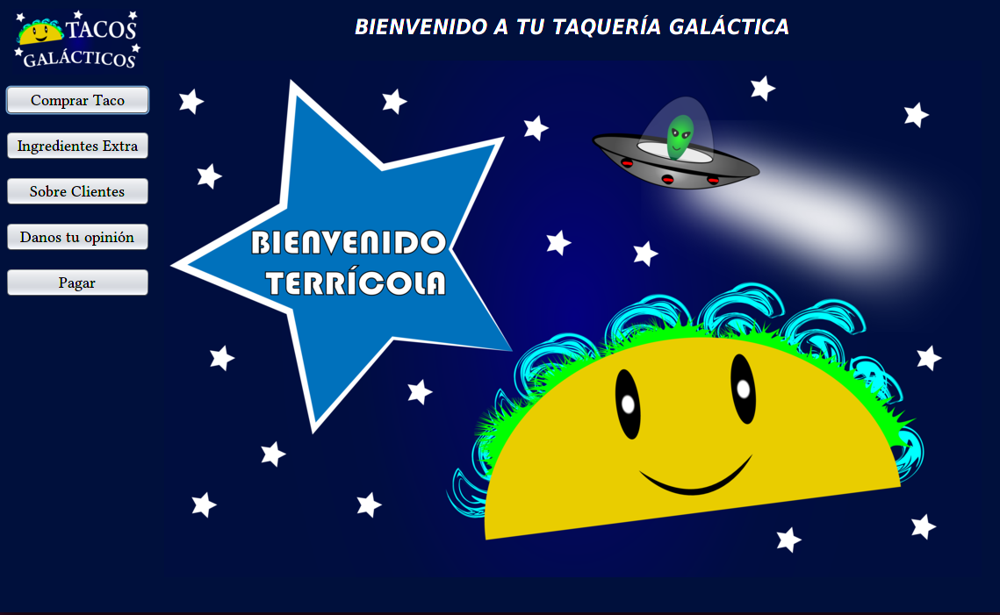
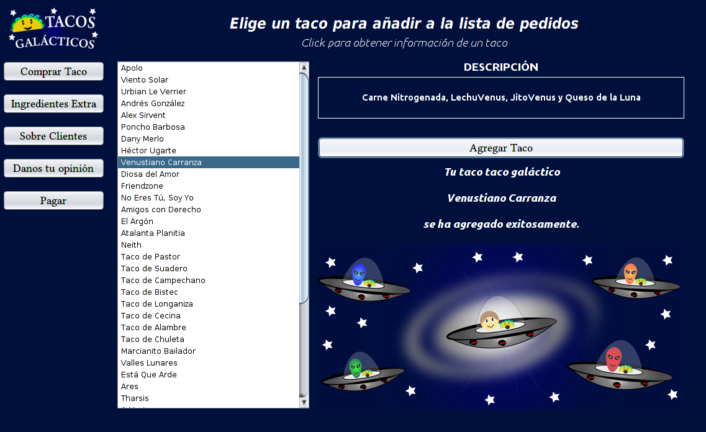
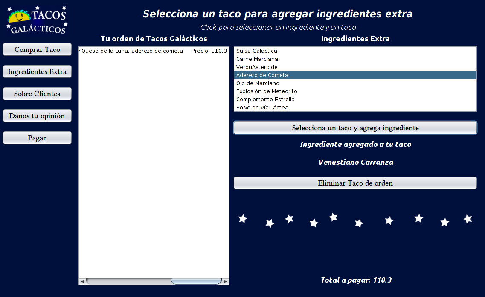
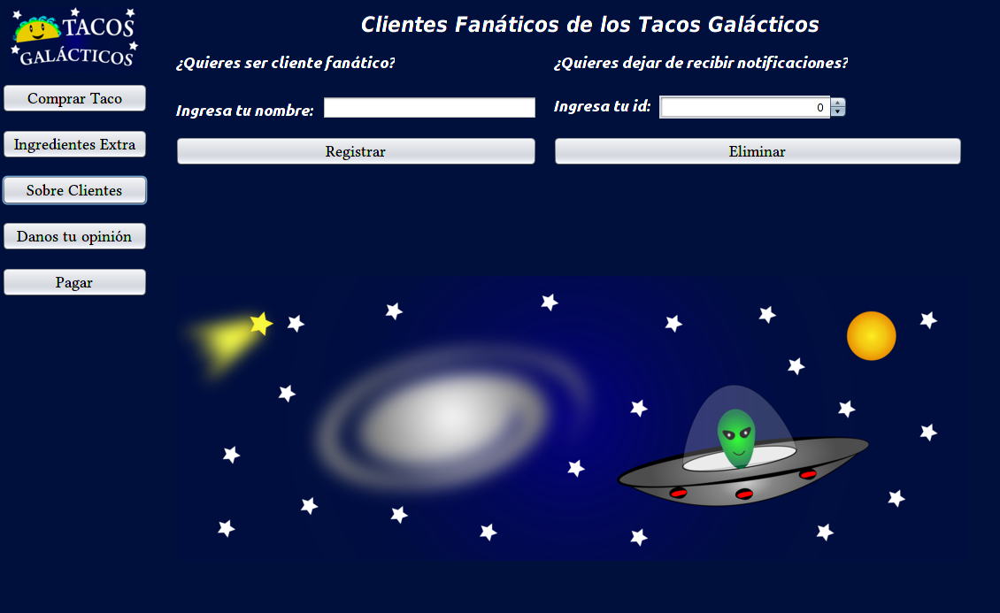
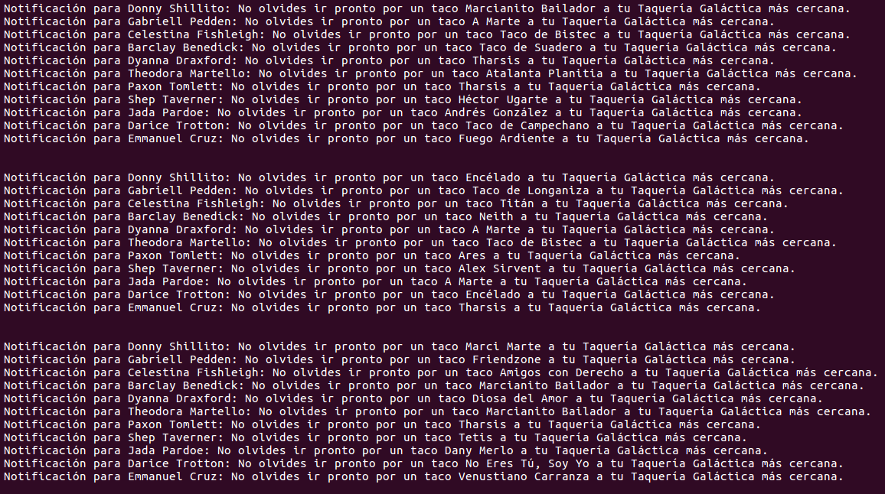
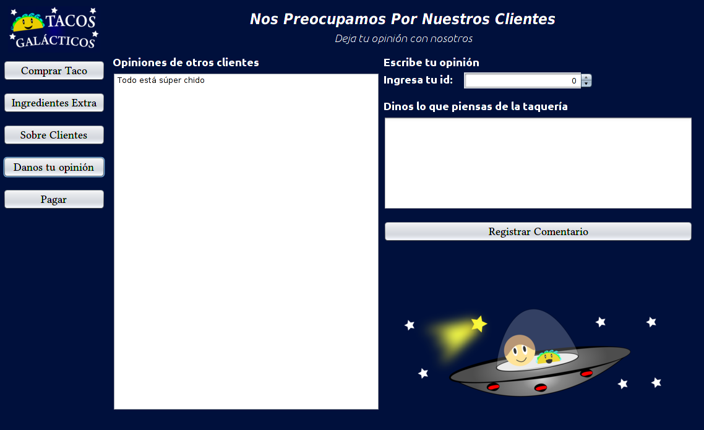
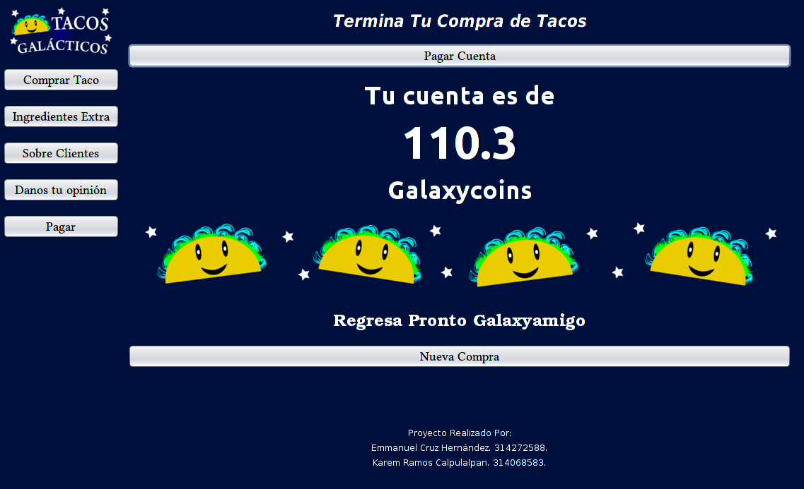

# Modelado y Programación
# Proyecto 2: Tacos Galácticos
## Emmanuel Cruz Hernández
## Karem Ramos Calpulalpan

### Desarrollo de la problemática

Después del gran éxito que ha tenido una taquería en el planeta tierra, los aliens han pensado crear sus propios tacos y exportarlos a la tierra con el fin de brindar más variedad de sabores en la carne (o lo que sea que agreguen a los tacos). Esta idea la han pensado 4 planetas: Marte, Mercurio, Saturno y Venus.

Los seres del planeta tierra aceptaron la idea de obtener más variedad de tacos. Por lo que se debe ajustar el menú de tacos fijos en la tierra con los nuevos tacos de los distintos planetas.

Después de algunos meses, las compañías encargadas de comprar tacos fuera del planeta notaron que los seres de la tierra amaron los nuevos tacos (sin excluir los normales y comunes), por lo que se creó un nuevo sistema de envío de información, en el cual se mandan notificaciones a todos los clientes frecuentes de la taquería recordando que coman tacos galácticos.

Para tener un mejor control de venta, los aliens y los seres de la tierra decidieron pedir ayuda a los estudiantes de la Facultad de Ciencias para crear un programa que pueda vender los tacos y muestre todas las funcionalidades descritas.

### Patrones de diseño utilizados

- **Iterator**: Cada uno de los planetas que acordaron crear sus propios tacos para la tierra no se pusieron de acuerdo entre ellos y guardaron sus tacos en estructuras de datos diferentes entre ellas. Marte guardó sus tacos en un ArrayList, Mercurio los guardó en una Hashtable, Saturno en una LinkedList y Venus en un arreglo. Y por alguna razón fuera de los límites del pensamiento de la galaxia, la tierra decidió guardar sus tacos en un ArrayDeque. Usamos iterator para poder acceder a los elementos de las estructuras mencionadas sin exponer su representación interna.
- **Observer**: Como se mencionó anteriormente, hay un sistema para notificar a los clientes frecuentes en la taquería. Usamos observer para permitir definir una dependencia de “uno a muchos” entre la taquería y los clientes. De esta forma podemos lograr que la taquería notifique a todos sus clientes frecuentes al cambiar el estado de la taquería.
- **Adapter**: Antes de la llegada de los tacos galácticos, ya se tenía una base para los tacos de la tierra, sin embargo, no se quiere cambiar el comportamiento de este código. Adapter nos va a permitir convertir la interfaz de la clase de los tacos de la tierra a una interfaz que se adaptará a la que esta hecha por los planeas que exportan los tacos galácticos.
- **Decorator**: Dado que las combinaciones de ingredientes en los tacos galácticos no satisfacen a todos los clientes, se ha decidido que estos tendrán la libertad de agregar ingredientes extra, aumentando el precio del taco y su descripción de ingredientes. El patrón decorator nos ayudará a atribuir responsabilidades adicionales a los tacos dinámicamente. Es decir, las características del taco aumentará dependiendo de los ingredientes extra que se quieran agregar a los tacos.
- **MVC**: Los datos que se guardarán en una base será información sobre los clientes frecuentes, nos interesa guardar su identificador id y su nombre. El sistema permitirá agregar y eliminar clientes de la base y los cambios se verán reflejados en un archivo que contendrá información sobre los datos. Además se tendrá una base con los tacos que vende cada uno de los planetas, incluyendo la base de los tacos del planeta tierra.
Finalmente, nos interesa saber lo que opinan los clientes frecuentes sobre los tacos, así como de la interfaz gráfica, el funcionamiento del programa, etc. Por lo que tenemos una sección en la que estos pueden dejar sus comentarios. Estos comentarios pueden agregarse a la base de datos de comentarios, pero los clientes no tienen la opción de eliminarlos, ya que es un proceso interno del sistema ajeno a los clientes.
La gestión de eventos estará reflejada en la clase principal de interacción con el usuario. En esta clase que llamaremos _SucursalMexico.java_ que representa el controlador, es donde se manipulan todas las herramientas necesarias para darle funcionalidad al software.
Finalmente, se tendrá una interfaz que permitirá la interacción con el usuario, sin mostrar su funcionamiento interno dado por el controlador ni del uso de los datos.

### Interfaz Gráfica

La interfaz gráfica consta de 6 vistas diferentes que se mencionaran a continuación.

- **Bienvenida**
	En esta vista sólo ofrecemos un saludo al usuario para darle la bienvenida a nuestro software.
	
- **Compra de un taco**
	En este panel le damos la oportunidad al usuario de elegir todos los tacos que desee comprar al seleccionar un taco y presionar el botón llamado \textit{Comprar Taco}. En el cuadro de descripción se muestran los ingredientes que contiene un taco al dar click sobre alguno de ellos.
	
- **Ingredientes Extra**
	En este apartado permitimos agregar ingredientes extra a los tacos seleccionados en el panel _Comprar Taco_. Para agregar un ingrediente extra es necesario seleccionar un taco de la lista de tacos comprados y un ingrediente extra, seguido de dar click en el botón _Seleccionar un taco y agregar ingrediente_.
	Además damos la oportunidad al usuario de eliminar algún taco que ya no quiera mantener en la lista de orden. Basta con seleccionar el taco a eliminar y presionar el botón _Eliminar Taco de orden_.
	

- **Sobre Clientes**
	Para ser cliente frecuente es necesario ingresar texto en el apartado para ingresar un nombre y presionar el botón _Registrar_. Una vez hecho esto, el usuario será notificado con un recordatorio para consumir tacos galácticos.
	Para eliminar la subscripción de la taquería, basta con ingresar el id del usuario presionar el botón \textit{Eliminar}.

	

	Las notificaciones a los usuarios está simulada con impresiones en la terminal. Como el usuario es ajeno al envió de notificaciones, ya que este proceso debe ser automático, hacemos uso de Threads para que cada cierto tiempo se esten enviando notificaciones a todos los usuarios que están en la base de datos de clientes. Las notificaciones se ven de la siguiente forma.

	

- **Opinión de los clientes**
	Permitimos a los usuarios dar a conocer lo que piensan otros clientes frecuentes de la taquería. Para poder ingresar un comentario, se debe estar en la base de datos de clientes frecuentes. Para lograr añadir un comentario a la lista es necesario identificar al usuario para saber que es cliente frecuente, escribir el comentario y presionar el botón \textit{Registrar Comentario}.
	Por tiempo, ya no agregamos la opción de que un usuario cuente con contraseña para poder ingresar un comentario o para poder eliminarse de la base de datos.

	

- **Pago**
	Este panel es un apartado para simular el pago del cliente a la taquería. El pago está dado por la suma del precio de todos los tacos que están en la orden. Estos tacos incluyen en sí el precio de los ingredientes extra si es que los contiene.

	

### Ejecución de la práctica

Se deben ingresar los siguientes comandos en una terminal que este en la carpeta llamada\\Proyecto02\_CruzEmmanuel\_RamosKarem

1. ant jar
2. ant run
3. ant clean

### Notas Adicionales

Dividimos nuestros archivos en las siguientes carpetas dentro de la carpeta llamada \textit{src}.

- **BaseDeDatos**
	Usamos archivos XML como apoyo para el almacenamiento de las bases de datos. Tenemos una clase lectora y escritora de archivos XML llamadas _LectorXML.java_ y _EscritorXML.java_, respectivamente.
	Los archivos XML que se usan para las lecturas y escrituras de las clases anteriores están almacenadas en esta carpeta.

- **Diagramas**
	En esta carpeta se encuentran todos los diagramas solicitados en las especificaciones del Proyecto02.

- **Imagenes**
	En esta carpeta almacenamos las imágenes usadas en la interfaz gráfica. Las imágenes fueron diseñadas por _Emmanuel Cruz Hernández_, integrante del equipo, por lo que no agregamos un autor externo.

- **taqueriaGalactica**
	Almacena toda la implementación del proyecto. Están todos los archivos con extensión .java así como un archivo con extensión .form que permite la ejecución de la interfaz gráfica del proyecto.

Usamos esta forma de almacenar todos nuestros archivos para que sea más cómodo encontrar cada uno de estos. 

Para lograr la simulación de que las notificaciones se estén enviando automáticamente hacemos uso de Threads. Este se encargará de estar enviando notificaciones a todos los clientes dentro de la base cada cierto tiempo. El Thread que realiza esta tarea está en la clase _SoftwareVenta.java_. Esta clase implementa la interfaz _Runnable_. El método _run_ es el encargado de enviar notificaciones infinitamente hasta que el programa termine su ejecución. El método _start()_ es llamada en el main de esta misma clase.

Finalmente, es importante mencionar que usamos la herramienta NetBeans para facilitar la creación de la interfaz gráfica.

